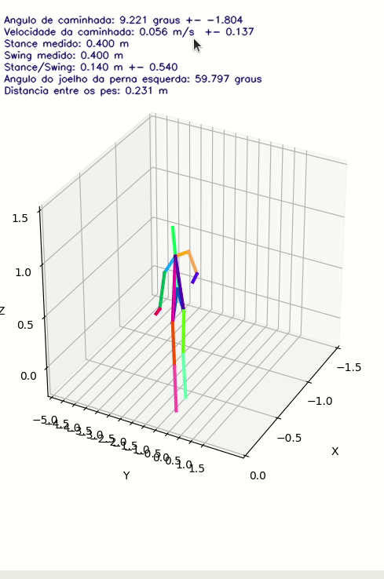

# Summary
- [Summary](#summary)
- [Preparando o ambiente](#preparando-o-ambiente)
- [Informações importantes](#informações-importantes)
  - [Comentários sobre o uso dos containers](#comentários-sobre-o-uso-dos-containers)
    - [Grouper](#grouper)
  - [Descrição de arquivos do espaço inteligente.](#descrição-de-arquivos-do-espaço-inteligente)
- [Câmeras novas do switch e o novo serviço de gateway](#câmeras-novas-do-switch-e-o-novo-serviço-de-gateway)
  - [Como iniciar as câmeras](#como-iniciar-as-câmeras)
- [Configurações do Labtef](#configurações-do-labtef)
- [Referências](#referências)
  - [Repositório do gateway das novas câmeras](#repositório-do-gateway-das-novas-câmeras)
  - [Artigos](#artigos)
  - [Espaço Inteligente](#espaço-inteligente)
  - [Calibração das câmeras](#calibração-das-câmeras)
  - [Skeleton Detector](#skeleton-detector)
- [Recomendações de estudo](#recomendações-de-estudo)
- [Reiniciando o PC 20 do Labtef](#reiniciando-o-pc-20-do-labtef)

---
# Preparando o ambiente

**Para utilizar o GitHub no Linux, é recomendado utilizar a extensão github nativa no VsCode**
1. Adicione o seu usuario para utilizar o docker sem sudo com `sudo usermod -aG docker $USER`.
2. Instale o `venv python3.6` através do comando ```sudo add-apt-repository ppa:jonathonf/python-3.6 && sudo apt-get update && sudo apt-get install python3.6 && sudo apt-get install python3-venv```
3. Instale o `tkinter` no Ubuntu através do comando `sudo apt install python3-tk` no terminal.
4. Crie uma pasta local para o projeto com o nome `desenvolvimento`
	<ol type="i">
	<li>Para sincronizar esse repositório à uma pasta local na sua máquina Linux, abra o terminal e digite <code>git clone https://github.com/LabTef-Ifes/espaco_inteligente_ifes</code> para o repositório principal ou <code>git clone https://github.com/LabTef-Ifes/espaco_inteligente_ifes-deivid</code> para <i>clonar</i> o fork de atualização.
	<li>
	    Crie um <i>virtual environment</i> para o projeto
		    Para criar um venv, digite <code>python3.6 -m venv venv</code> no diretório reservado ao projeto.
	<li>Ative o ambiente virtual com o comando <code>source venv/bin/activate</code>.
	</ol>
5. Dentro da pasta clonada, clone o repositório [is-camera-py-labtef](https://github.com/LabTef-Ifes/is-cameras-py-labtef) com o comando `git clone https://github.com/LabTef-Ifes/is-cameras-py-labtef` 
6. Com o `venv` ativo, instale as bibliotecas necessárias para o espaço inteligente (EI) escritas no arquivo [requirements.txt](requirements.txt) através do comando `pip install -r requirements.txt`.
7. Execute os containers necessários para o funcionamento do EI: execute o arquivo [iniciar_principais_containers.py](iniciar_principais_containers.py). Caso se depare com o erro de **permission denied**, execute o arquivo [sh_permission_denied.py](sh_permission_denied.py) e execute o arquivo [iniciar_principais_containers.py](iniciar_principais_containers.py) novamente.
8. Em outro terminal, digite `sudo docker stats` para verificar se os containers estão rodando (*Ctrl+C para fechar*). Os containers em funcionamento do EI são (verificar o parâmetro _NAME_ no terminal):
   

    | containers ativos (**Comunicação**) |                                                                                             **descrição** |
    | :---------------------------------- | --------------------------------------------------------------------------------------------------------: |
    | rabbitmq                            |                                                                          Canal de comunicação dos tópicos |
    | zipkin                              |                                                             Exibe e organiza os tópicos para visualização |
    | **Câmeras antigas[^1]**             |                                                                                             **descrição** |
    | cam0                                |                                                                                           Conexão da cam0 |
    | cam1                                |                                                                                           Conexão da cam1 |
    | cam2                                |                                                                                           Conexão da cam2 |
    | cam3                                |                                                                                           Conexão da cam3 |
    | **Reconstrução**                    |                                                                                             **descrição** |
    | skX (X in [1,2,...])                | Serviço de transformação dos esqueletos 2d em esqueletos 3d. Utilizado no arquivo request-3d-skeletons.py |
    | is-frame_transformation             |                                            Serviço de transformar esqueletos 2d em 3d usando a calibração |
    | grouper                             |                                                                    Descrito na [citação abaixo](#grouper) |
<!-- Comentado pois não é mais necessário ajustar essa pasta, pois está em relative path na pasta videos, dentro de dataset-creator. 8. Ajuste o diretório da pasta com os vídeos a serem salvos/analisados no arquivo **`dataset-creator/options.json`**. -->

---
# Informações importantes

- Para alterar os parâmetros de `fps`, `width`, `height` e `color` das câmeras, utlize o [options/copia_json.py](options/copia_json.py)
- O arquivo `capture-images.py` só irá mostrar as imagens das 4 câmeras com todas elas funcionando. Caso uma ou mais câmeras não esteja funcionando, o programa não irá mostrar as imagens.
- A câmera *antiga*[^1] possui uma limitação quanto ao número de frames por segundo de acordo com seu modo de cor. 
  1. Na opção **RGB** (*pixel format RGB8*) as câmeras funcionam com até **12 fps** (1288 width, 728 heigth).
  2. Na opção **GRAY** (*pixel format Mono8*) as câmeras irão funcionar com até **30 fps** (1288 width, 728 heigth). 
  3. Informações adicionais podem ser encontradas nas [referências técnicas](./referencias-tecnicas) das câmeras.
- As alterações realizadas nos arquivos `options/X.json` (sendo X = 0, 1, 2 ou 3) somente surtirão efeito ao inicializar os containers. 
  Caso os containers estejam ativos e for realizado alguma mudanças nos arquivos .json, os containers deverão ser parados e reinicializados.
- Para parar todos os containers de uma só vez utilize o comando: `sudo docker container stop $(sudo docker container ls -q)`
- O Flycapture SDK, software do fabricante das câmeras, é compatível com o modelo *antigo*[^1].
  
- o arquivo [options.json](dataset-creator/options.json) está vinculado às câmeras antigas e à captura de imagem, portando ele permanece sendo necessário de se atualizar quando mudar parâmetros das câmeras
## Comentários sobre o uso dos containers
O sistema de containeres foi criado pelo Felippe na Ufes e utilizado em seu mestrado.

Há diversos topicos de comunicação relacionados à captura de imagem, envio de imagem e construção do esqueleto

O `rabbit` e o `zipkin` são essenciais para a utilização da comunicação do EI e devem ser os primeiros serviços iniciados

A ultima versão desenvolvida na Ufes do `frame-transformation` é a `0.0.4`

Para calibrar as cameras, é necessario adicionar os arquivos `.json` com o _schema_ correto no diretorio definido no volume do docker `is-frame_transformation`

[^1]: modelo antigo **Blackfly GigE BFLY-PGE-09S2C**
### Grouper
<blockquote class="quote">
  "O serviço <a href='https://github.com/labviros/is-skeletons-grouper'>grouper</a>, quando operado no mode Stream, consome localizações de esqueleto feitas pelo serviço <a href='https://github.com/labviros/is-skeletons-detector'>is-skeletons-detector</a> por meio do tópico <code>SkeletonsDetector.(ID).Detection</code>, agrupa as localizações 2D dos esqueletos dentro de uma janela de tempo <i>a cada 100ms por exemplo</i>, faz a reconstrução 3D e publica em outro tópico <code>SkeletonsGrouper.(GROUP_ID).Localization</code> a localização. Ele também pode operar no modo <b>RPC</b>, em que você envia um grupo de esqueletos 2D, e ele retorna as localizações 3D. Esse serviço depende do serviço de <a href='https://github.com/labviros/is-frame-transformation'>Frame Transformation</a>, e este serviço precisa da pasta com as calibrações para inicializar."
  <p>- 
      <cite>Felippe Mendonça</cite>
      <footer><time datetime="2023-05-22">22 de maio de 2023</time></footer>
  </p>
</blockquote>

## Descrição de arquivos do espaço inteligente.

- [options/X.json](options/0.json) - parâmetros da câmera X (câmeras 0, 1, 2 e 3). Neste arquivo é possível alterar parâmetros relativos a câmera: `IP`, `fps`, `height`, `width` e etc.
- [dataset-creator/options.json](dataset-creator/options.json) - Parâmetros da criação gravação e análise dos vídeos. Neste arquivo é possível alterar o diretório onde os frames das câmeras serão salvos, para posteriormente formarem vídeos. 
- [dataset-creator/captura_monta_e_analisa_video.py](dataset-creator/captura_monta_e_analisa_video.py) - Executa todo o sistema em sequência, desde a captura até a análise final.
- [visualizar_camera.py](visualizar_camera.py) - arquivo teste para visualizar a imagem de uma câmera.
- [dataset-creator/capture-images.py](dataset-creator/capture-images.py) - realiza a captura dos frames das 4 câmeras e os salva no diretório especificado em '/dataset-creator/options.json'. Comandos válidos: `s` inicia a gravação (salvar imagens), `p` pausa a gravação, `q` fecha o programa.
- [dataset-creator/make-videos.py](/dataset-creator/make-videos.py) - A partir dos frames capturados pelo arquivo `capture-images.py`, monta os vídeos de cada câmera e os salva em formato `.mp4`.
- [dataset-creator/request-2d-skeletons.py](dataset-creator/request-2d-skeletons.py) - #TODO
- [dataset-creator/request-3d-skeletons.py](dataset-creator/request-3d-skeletons.py) - #TODO
- [dataset-creator/export-video-3d-medicoes-e-erros.py](dataset-creator/export-video-3d-medicoes-e-erros.py) - _Re_#TODO
- [dataset-creator/Parameters.py](dataset-creator/Parameters.py) - programa que possui funções usadas no arquivo `export-video-3d-medicoes-e-erros.py`.
# Câmeras novas do switch e o novo serviço de gateway
**❗Há problemas de conflito ao se utilizar o Spinnaker enquanto os containers das câmeras antigas estão ativos.**

As câmeras *novas*[^2] adquiridas recentemente para o EI não funcionam com o serviço de gateway já disponível. Desta forma, [um novo serviço de gateway](https://github.com/LabTef-Ifes/is-cameras-py) foi desenvolvido. Em sua primeira utilização, execute as instruções contidas no readme e conseguirá visualizar a imagem de uma câmera. 

Para iniciar as quatro câmeras de uma só vez, execute o comando `sudo docker compose up` dentro da pasta `deploy/multi-camera`. As configurações das câmeras podem ser alterados nos arquivos `settings-camera-X.yaml` (sendo X = 0, 1, 2 ou 3) também contidos na pasta `deploy/multi-camera`. Caso só exista o arquivo correspondeste a uma câmera, crie os demais. Os parâmetros disponíveis para alteração são `fps`, `formato de cores`, `height`, `width` e `ratio`. Com os containers ativos, os arquivo do EI podem ser utilizados normalmente. Os containers que estarão ativos serão (_Name_):

| Containers                     |            descrição |
| :----------------------------- | -------------------: |
| multi-camera-rabbitmq-1        | Comunicação RabbitMQ |
| multi-camera-is-mjpeg-server-1 |                #TODO |
| multi-camera-camera-0-1        |  Conexão da câmera 0 |
| multi-camera-camera-1-1        |  Conexão da câmera 1 |
| multi-camera-camera-2-1        |  Conexão da câmera 2 |
| multi-camera-camera-3-1        |  Conexão da câmera 3 |

- O Readme contido dentro do arquivo `spinnaker-2.7.0.128-Ubuntu18.04-amd64-pkg.tar.gz` possui informações -_sobre alteração de buffer, por exemplo_- que podem ajudar caso esteja ocorrendo algum problema de captura de imagem.
- O `Spinnaker SDK` é o software do fabricante das câmeras compatível com o modelo *novo*[^2] e com o modelo *antigo*[^1]
<!-- Aqui está Spinnaker SDK e mais acima está Flycapture SDK. Qual é o certo? -->

[^2]: modelo novo **Blackfly S GigE BFS-PGE-16S2C-CS**
## Como iniciar as câmeras

1. Conecte a câmera no Switch físico
2. Abra o software **SpinView**
3. Clique com o botão direito no IP da câmera e clique em `Auto Force IP`
4. Confira que os IP's das câmeras estão corretos nos arquivos `settings-camera-X.yaml`, dentro de [multi-camera](is-cameras-py-labtef\deploy\multi-camera)
5. Inicie os containeres com o comando `python iniciar_principais_containers.py` na pasta principal.
6. Confira que os containeres listados estão em execução
7. As câmeras foram iniciadas, visualize-as com o script `capture_images.py` executado dentro do `venv`
<!-- Necessário completar -->

# Configurações do Labtef

| Item                   |                           Detalhamento |
| :--------------------- | -------------------------------------: |
| S.O                    |                     Ubuntu 18.04.5 LTS |
| Processador            | Intel® Core™ i5-8400 CPU @ 2.80GHz × 6 |
| RAM                    |                                   16GB |
| Placa de vídeo         |      NVIDIA GeForce GTX 1070/PCIe/SSE2 |
| Placa de rede          |                       fibra ótica 10Gb |
| Versão do Python       |                                  3.6.9 |
| Switch                 |          3Com Switch 4800G PWR 24-Port |
| Portas com PoE ativado |                    19, 21, 22, 23 e 24 |

# Referências

## Repositório do gateway das novas câmeras
[Spinnaker Gateway do Felippe Mendonça](https://github.com/LabTef-Ifes/is-cameras-py)

## Artigos
- [Drive da Mariana](https://drive.google.com/drive/folders/1TIPGF9pkX-jDV5Voz08XtdeS18ijzYBG?usp=sharing)
- [PPSUS 2021](https://drive.google.com/drive/folders/1USJJMGo9zSRY3Z4sJmGX9pXoy-Q5_ksf?usp=sharing)
## Espaço Inteligente
- [Curso de Espaço Inteligente](https://github.com/LabTef-Ifes/CursoEI)
- Projeto original: [LabViros](https://github.com/labviros)
- [Repositório do Wyctor](https://github.com/wyctorfogos/ESPACOINTELIGENTE-IFES)
- [dataset-creator original](https://github.com/felippe-mendonca/dataset-creator/)
## Calibração das câmeras

- [is-aruco-camera-calibration](https://github.com/LabTef-Ifes/is-aruco-camera-calibration) *Referência*
- [Camera Calibration New](https://github.com/LabTef-Ifes/camera-calibration-new) **Working**
- [Camera Calibration](https://github.com/LabTef-Ifes/camera-calibration) **Deprecated**

## Skeleton Detector
- [Skeleton Detector do Felippe Mendonça](https://github.com/labviros/is-skeletons-detector)

---
# Recomendações de estudo

- [CursoEI](https://github.com/LabTef-Ifes/CursoEI)
- [Github by The Coding Train](https://www.youtube.com/playlist?list=PLRqwX-V7Uu6ZF9C0YMKuns9sLDzK6zoiV)
- [Curso de Git e GitHub do CursoEmVideo](https://www.cursoemvideo.com/curso/curso-de-git-e-github/)

---

# Reiniciando o PC 20 do Labtef
Em caso de crash do pc, é necessário reiniciá-lo pelo botão físico e seguir os passos abaixo .
1. Selecione Ubuntu no menu de fundo roxo
2. digite `fsck /dev/sda1` na tela preta de terminal _atenção ao espaço_
3. aperte `y` para aceitar cada alteração
4. digite `reboot`
